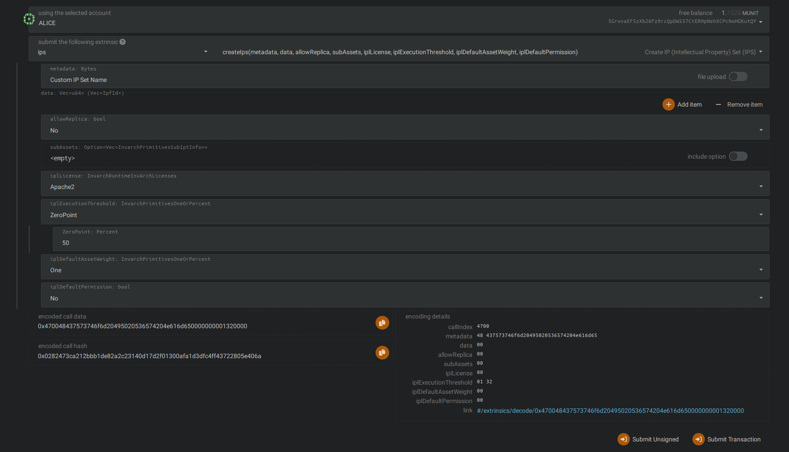

# git-remote-gitarch
A Git helper that integrates INV4 with the Git protocol.

## Installing
Make sure you already have `cargo` and `rust` installed. Then:
```sh
cargo install --git https://github.com/InvArch/git-remote-gitarch
```
The binary will be installed at `~/.cargo/bin/` as `git-remote-inv4`

## Testing
Testing requires a running a local node and creating an IP Set on it.

### Running the local node:
```sh
git clone https://github.com/InvArch/InvArch-Node
cd InvArch-Node
make setup-testing
``` After compiling, open 2 terminals in the `InvArch-Node` directory, and run this commands in each:
```sh
# On terminal 1:
make run-solo-alice

# On terminal 2:
make run-solo-bob
```

### Creating the IP Set
1. Go to the [Polkadot apps website](https://polkadot.js.org/?rpc=ws://127.0.0.1:9944#). The link already opens in the local node.
2. Go to the [Extrinsics](https://polkadot.js.org/?rpc=ws://127.0.0.1:9944#/extrinsics) tab by hovering on the `Developer` menu.
3. Write the following in the fields: 
4. Click on `Submit Transaction` then `Sign and Submit`.
5. IP Set should've been created with the ID 0.

### Using the tool
If not initialized, you should initialize a git repository in the directory you want.
```sh
git init
```
Then create some files and add them with `git add <file>` or `git add -A`

After that, files must be commited:
```sh
git commit -m "First line of commit" -m "Second line of commit"
```
Then the remote should be set by running:
```sh
# 0 is the ID of the IP Set we made earlier
git remote add origin "inv4://0"
```
And finally:
```sh
git push origin master
```

You may also pull new files added to the IPS using `git pull origin master`
