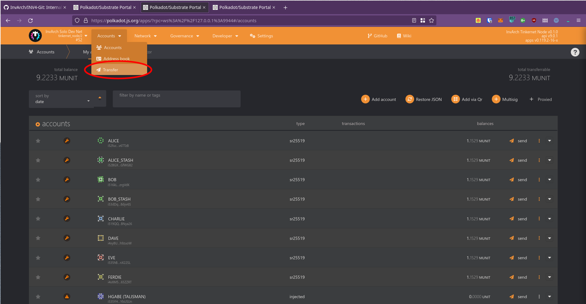
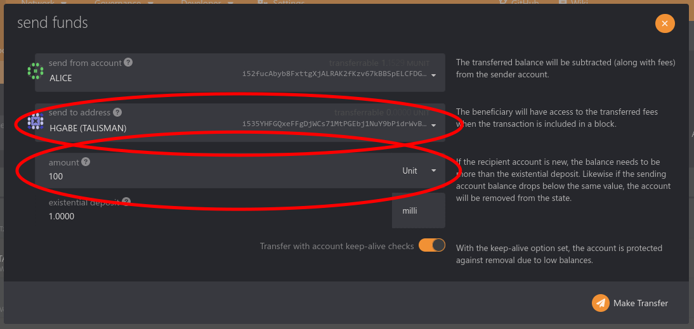
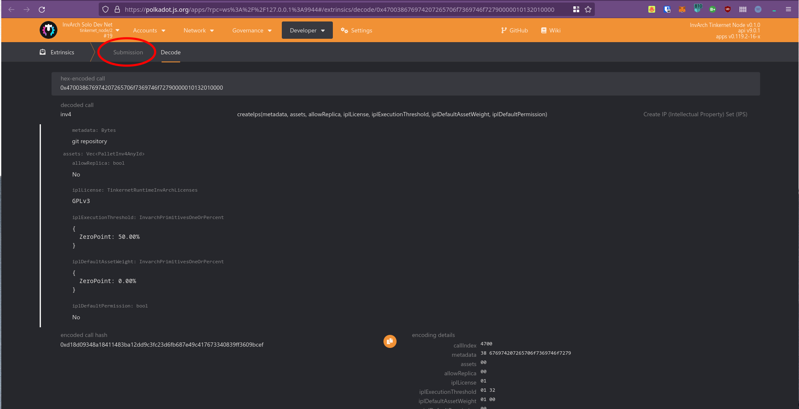

# git-remote-inv4
A Git helper that integrates INV4 with the Git protocol.

## Installing
Make sure you already have `cargo` and `rust` installed. Then:
```sh
cargo install --git https://github.com/InvArch/INV4-Git
```
The binary will be installed at `~/.cargo/bin/` as `git-remote-inv4`

## Testing
Testing requires running an IPFS node, running a local InvArch node and creating an IP Set on it.

### Running the local IPFS node:
Install the ipfs cli binary from a package manager, or follow the instructions on the [IPFS documentation](http://docs.ipfs.tech.ipns.localhost:8080/install/command-line/#linux) to get the binary installed in your system.

After you installed the IPFS cli tool, open a terminal and run the following commands:
```sh
ipfs init
ipfs daemon
```
Now set that terminal aside, it will run the IPFS node until you manually kill it or close the terminal.


### Running the local InvArch node:
On a new terminal, run the following:
```sh
git clone https://github.com/InvArch/InvArch-Node
cd InvArch-Node
make build
make run-solo-alice
```

Now that you have built the node binary and that terminal is running a collator, open a second terminal on the same location, and run another collator with the following command:
```sh
make run-solo-bob
```

A development node will start running and should be accessible from `ws://127.0.0.1:9944` (or directly in polkadot.js at https://polkadot.js.org/?rpc=ws://127.0.0.1:9944)
You can now set these terminals aside too.

### Sending tokens to your account
You're gonna need an account for which you have the seed phrase on hand, you can create a new account for this.
To send tokens to that account, follow these steps:
1. Go to this page in polkadot.js: https://polkadot.js.org/apps/?rpc=ws%3A%2F%2F127.0.0.1%3A9944#/accounts
2. On the tabs, hover over the accounts tab and click transfer, as shown in the image: 
3. Select Alice as the sender account in the first field.
4. Paste your account in the second field and an arbitrary amount in the third field, 100 in the case of the example: 
5. Click the make transfer button and confirm the transaction.

### Creating the IP Set
1. Open the pre-made extrinsic in polkadot.js using the following URL: https://polkadot.js.org/apps/?rpc=ws%3A%2F%2F127.0.0.1%3A9944#/extrinsics/decode/0x470038676974207265706f7369746f72790000010132010000
2. Go to the submission tab: 
3. Submit the transaction using the account that you sent tokens to.

An IP Set should have been created with the ID `0`

### Using the tool
Using a terminal, navigate to a directory where you'll create a new git repository and run the following commands (considering you're on Linux):
 ```sh
mkdir test-repo
cd test-repo
touch test-file
echo test > test-file
git init
git remote add origin inv4://0
git add *
git commit -m "First commit!"
```

This next command will send your files to the chain, it will ask for your seed phrase, just paste it in the terminal and press Enter:
```sh
git push origin master
```

Now you have created a new local git repository, added some files, linked to the IPS you created on-chain and pushed your local commit to the chain!

To demonstrate that it really is on-chain, go to a new directory and clone the git repo from the chain using the following command:
```sh
git clone inv4://0 cloned
```

Now you can navigate inside this cloned repo and verify that it's the same as the one you pushed!
